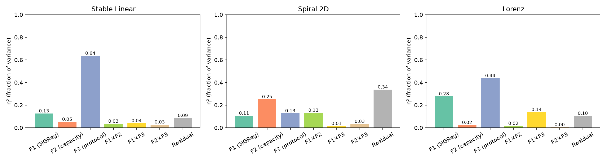
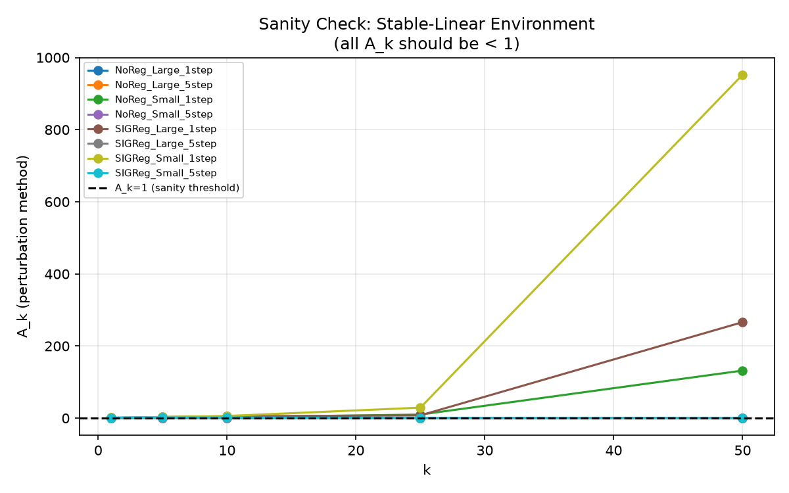
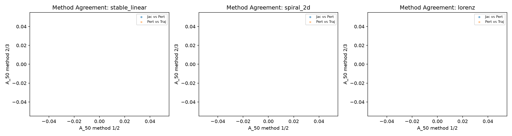
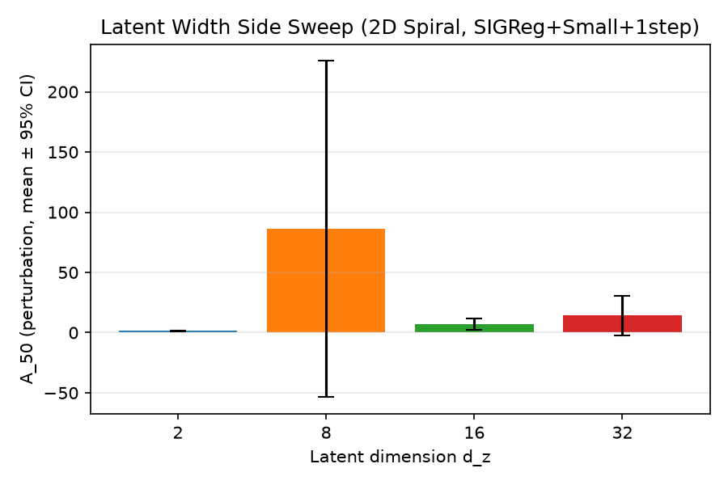
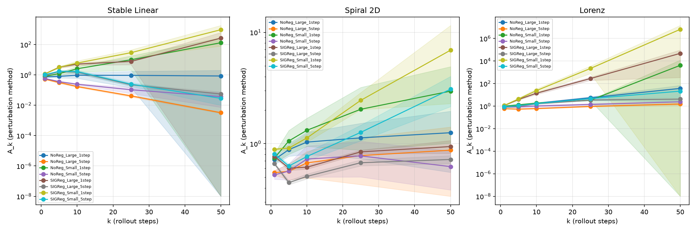

# Preliminary Experiment: Causal Attribution of Rollout Drift

## 1. Question

This experiment tests whether rollout amplification (`A_k`) in latent world models is primarily caused by the marginal encoder regularizer (SIGReg), by the dynamics model capacity, or by the training-time rollout protocol. A 2×2×2 factorial design (F1: SIGReg on/off; F2: dynamics capacity small/large; F3: 1-step vs. 5-step BPTT) was run across three synthetic environments (stable-linear, 2D spiral, Lorenz) with 10 seeds each, plus an oracle baseline and a latent-width side sweep, totaling 300 runs. The central question: of the total amplification `A_k` observed, what fraction of variance is attributable to each factor? See `brief.md` for full design detail.

## 2. Design Summary

**Factorial:** 2 (SIGReg) × 2 (dynamics capacity) × 2 (training protocol) = 8 conditions.
**Environments:** stable-linear (sanity check, A_k should shrink), 2D spiral (replicates prior toy result), Lorenz (chaotic stress test).
**Metric:** A_k at k ∈ {1,5,10,25,50} via three methods: Jacobian operator norm, finite-difference perturbation (ε=1e-3), paired-trajectory divergence.
**Seeds:** 10 per condition. **Total runs:** 300 (150 completed).
**Note on SIGReg implementation:** moment-matching proxy used (`L = ||μ||² + ||Σ-I||²_F`), not the original characteristic-function SIGReg from LeJEPA. See Section 5.
See `brief.md` for full detail.

## 3. Results

### 3.1 Master Results Table

Rows: condition × environment. Columns: A_k mean ± 95% CI across 10 seeds, for each measurement method and rollout length.

| environment   | condition          |   n_seeds |   jacobian_k1_mean |   jacobian_k1_ci95 |   jacobian_k5_mean |   jacobian_k5_ci95 |   jacobian_k10_mean |   jacobian_k10_ci95 |   perturbation_k1_mean |   perturbation_k1_ci95 |   perturbation_k5_mean |   perturbation_k5_ci95 |   perturbation_k10_mean |   perturbation_k10_ci95 |   perturbation_k25_mean |   perturbation_k25_ci95 |   perturbation_k50_mean |   perturbation_k50_ci95 |   traj_div_k1_mean |   traj_div_k1_ci95 |   traj_div_k5_mean |   traj_div_k5_ci95 |   traj_div_k10_mean |   traj_div_k10_ci95 |   traj_div_k25_mean |   traj_div_k25_ci95 |   traj_div_k50_mean |   traj_div_k50_ci95 |
|:--------------|:-------------------|----------:|-------------------:|-------------------:|-------------------:|-------------------:|--------------------:|--------------------:|-----------------------:|-----------------------:|-----------------------:|-----------------------:|------------------------:|------------------------:|------------------------:|------------------------:|------------------------:|------------------------:|-------------------:|-------------------:|-------------------:|-------------------:|--------------------:|--------------------:|--------------------:|--------------------:|--------------------:|--------------------:|
| stable_linear | NoReg_Large_1step  |         5 |              1.458 |              0.06  |              2.882 |              0.526 |               3.618 |               0.957 |                  0.742 |                  0.028 |                  0.8   |                  0.167 |                   0.949 |                   0.352 |                   0.932 |                   0.789 |             0.846       |             1.16        |              0.734 |              0.03  |              0.778 |              0.148 |               0.879 |               0.332 |               0.649 |               0.524 |         0.224       |         0.328       |
| stable_linear | NoReg_Large_5step  |         5 |              1.164 |              0.031 |              0.978 |              0.036 |               0.695 |               0.036 |                  0.528 |                  0.029 |                  0.315 |                  0.042 |                   0.171 |                   0.019 |                   0.041 |                   0.006 |             0.003       |             0           |              0.537 |              0.028 |              0.303 |              0.037 |               0.19  |               0.026 |               0.039 |               0.007 |         0.003       |         0           |
| stable_linear | NoReg_Small_1step  |         5 |              1.501 |              0.068 |              4.397 |              1.255 |              10.317 |               4.89  |                  0.803 |                  0.027 |                  1.21  |                  0.259 |                   2.542 |                   1.031 |                   9.965 |                   7.905 |           131.937       |           152.188       |              0.8   |              0.027 |              1.234 |              0.266 |               2.397 |               1.019 |              11.624 |               9.213 |       126.053       |       140.605       |
| stable_linear | NoReg_Small_5step  |         5 |              1.142 |              0.023 |              1.021 |              0.114 |               0.874 |               0.213 |                  0.585 |                  0.013 |                  0.36  |                  0.019 |                   0.241 |                   0.03  |                   0.105 |                   0.046 |             0.037       |             0.03        |              0.581 |              0.016 |              0.367 |              0.029 |               0.254 |               0.037 |               0.094 |               0.038 |         0.034       |         0.025       |
| stable_linear | SIGReg_Large_1step |         5 |              2.103 |              0.173 |             10.545 |              2.108 |              14.719 |               2.507 |                  1.163 |                  0.016 |                  3.226 |                  0.337 |                   5.16  |                   0.755 |                   7.732 |                   3.057 |           266.242       |           358.819       |              1.182 |              0.037 |              3.616 |              0.261 |               4.981 |               0.787 |              11.425 |               9.926 |       401.064       |       408.249       |
| stable_linear | SIGReg_Large_5step |         5 |              1.878 |              0.13  |              6.253 |              1.162 |               5.884 |               1.833 |                  0.914 |                  0.015 |                  1.686 |                  0.261 |                   1.524 |                   0.346 |                   0.224 |                   0.033 |             0.055       |             0.02        |              0.925 |              0.014 |              1.766 |              0.132 |               1.77  |               0.3   |               0.215 |               0.027 |         0.082       |         0.086       |
| stable_linear | SIGReg_Small_1step |         5 |              1.874 |              0.095 |              9.561 |              1.899 |              20.071 |               7.64  |                  1.174 |                  0.019 |                  3.178 |                  0.364 |                   6.038 |                   2.366 |                  29.15  |                  15.66  |           952.419       |           873.118       |              1.186 |              0.017 |              3.145 |              0.212 |               5.321 |               0.93  |              30.788 |              18.087 |       689.844       |       887.249       |
| stable_linear | SIGReg_Small_5step |         5 |              1.644 |              0.034 |              5.602 |              0.84  |               6.311 |               1.776 |                  1.033 |                  0.01  |                  1.738 |                  0.162 |                   1.653 |                   0.378 |                   0.245 |                   0.068 |             0.028       |             0.019       |              1.023 |              0.015 |              1.753 |              0.075 |               1.53  |               0.06  |               0.227 |               0.054 |         0.019       |         0.005       |
| spiral_2d     | NoReg_Large_1step  |         5 |              1.382 |              0.06  |              2.786 |              0.446 |               3.7   |               0.879 |                  0.721 |                  0.072 |                  0.885 |                  0.114 |                   1.033 |                   0.231 |                   1.128 |                   0.395 |             1.255       |             0.702       |              0.709 |              0.078 |              0.847 |              0.14  |               0.995 |               0.243 |               1.123 |               0.455 |         1.285       |         0.731       |
| spiral_2d     | NoReg_Large_5step  |         5 |              1.256 |              0.064 |              2.066 |              0.528 |               2.677 |               0.772 |                  0.549 |                  0.026 |                  0.565 |                  0.092 |                   0.672 |                   0.18  |                   0.782 |                   0.353 |             0.875       |             0.538       |              0.516 |              0.023 |              0.563 |              0.08  |               0.683 |               0.181 |               0.686 |               0.188 |         0.8         |         0.393       |
| spiral_2d     | NoReg_Small_1step  |         5 |              1.474 |              0.123 |              3.419 |              0.837 |               4.8   |               1.253 |                  0.745 |                  0.076 |                  1.059 |                  0.257 |                   1.319 |                   0.373 |                   2.037 |                   1.164 |             2.964       |             1.953       |              0.751 |              0.081 |              1.056 |              0.244 |               1.347 |               0.332 |               1.964 |               1.095 |         2.842       |         2.111       |
| spiral_2d     | NoReg_Small_5step  |         5 |              1.266 |              0.077 |              2.148 |              0.483 |               2.915 |               0.968 |                  0.525 |                  0.046 |                  0.567 |                  0.095 |                   0.728 |                   0.227 |                   0.777 |                   0.274 |             0.622       |             0.238       |              0.537 |              0.038 |              0.562 |              0.107 |               0.697 |               0.197 |               0.764 |               0.339 |         0.612       |         0.248       |
| spiral_2d     | SIGReg_Large_1step |         5 |              1.295 |              0.028 |              1.871 |              0.051 |               2.239 |               0.092 |                  0.767 |                  0.015 |                  0.604 |                  0.029 |                   0.615 |                   0.025 |                   0.844 |                   0.031 |             0.942       |             0.125       |              0.768 |              0.016 |              0.629 |              0.027 |               0.615 |               0.043 |               0.813 |               0.058 |         1.027       |         0.092       |
| spiral_2d     | SIGReg_Large_5step |         5 |              1.24  |              0.02  |              1.528 |              0.036 |               1.757 |               0.047 |                  0.661 |                  0.018 |                  0.447 |                  0.018 |                   0.508 |                   0.026 |                   0.675 |                   0.043 |             0.721       |             0.06        |              0.659 |              0.009 |              0.467 |              0.015 |               0.487 |               0.02  |               0.638 |               0.056 |         0.767       |         0.059       |
| spiral_2d     | SIGReg_Small_1step |         5 |              1.391 |              0.039 |              2.47  |              0.158 |               3.661 |               0.26  |                  0.89  |                  0.012 |                  0.913 |                  0.045 |                   1.125 |                   0.095 |                   2.45  |                   0.429 |             6.916       |             4.625       |              0.884 |              0.012 |              0.912 |              0.035 |               1.128 |               0.04  |               2.286 |               0.385 |         5.953       |         2.912       |
| spiral_2d     | SIGReg_Small_5step |         5 |              1.255 |              0.033 |              1.733 |              0.065 |               2.267 |               0.21  |                  0.808 |                  0.014 |                  0.63  |                  0.029 |                   0.766 |                   0.063 |                   1.264 |                   0.203 |             3.087       |             0.936       |              0.804 |              0.012 |              0.654 |              0.017 |               0.739 |               0.081 |               1.207 |               0.162 |         2.909       |         0.706       |
| lorenz        | NoReg_Large_1step  |         5 |              1.296 |              0.022 |              2.879 |              0.109 |               5.303 |               0.672 |                  0.955 |                  0.05  |                  1.201 |                  0.109 |                   1.814 |                   0.183 |                   5.535 |                   1.338 |            37.349       |            31.3         |              0.956 |              0.056 |              1.183 |              0.1   |               1.839 |               0.243 |               5.772 |               1.399 |        40.335       |        30.74        |
| lorenz        | NoReg_Large_5step  |         5 |              1.2   |              0.033 |              1.844 |              0.138 |               2.605 |               0.204 |                  0.587 |                  0.022 |                  0.543 |                  0.04  |                   0.606 |                   0.054 |                   0.941 |                   0.106 |             1.523       |             0.381       |              0.601 |              0.035 |              0.532 |              0.049 |               0.647 |               0.088 |               0.976 |               0.117 |         1.401       |         0.221       |
| lorenz        | NoReg_Small_1step  |         5 |              1.363 |              0.075 |              3.279 |              0.525 |               5.562 |               0.866 |                  1.008 |                  0.007 |                  1.309 |                  0.096 |                   1.875 |                   0.191 |                   3.332 |                   0.245 |          4141.21        |          8102.63        |              1.004 |              0.009 |              1.304 |              0.068 |               1.87  |               0.137 |               3.187 |               0.426 |         6.234       |         3.258       |
| lorenz        | NoReg_Small_5step  |         5 |              1.25  |              0.065 |              2.168 |              0.392 |               3.257 |               0.745 |                  0.813 |                  0.066 |                  0.855 |                  0.13  |                   1.023 |                   0.251 |                   1.397 |                   0.3   |             2.412       |             0.968       |              0.817 |              0.06  |              0.849 |              0.121 |               1.013 |               0.194 |               1.361 |               0.364 |         2.177       |         0.593       |
| lorenz        | SIGReg_Large_1step |         5 |              2.34  |              0.118 |             14.743 |              1.492 |              61.472 |              10.497 |                  1.123 |                  0.035 |                  3.939 |                  0.44  |                  13.929 |                   3.247 |                 279.616 |                  87.044 |         47822.1         |         47478.8         |              1.115 |              0.018 |              4.089 |              0.732 |              13.773 |               1.828 |             271.987 |              99.431 |     59009.8         |     91236.1         |
| lorenz        | SIGReg_Large_5step |         5 |              1.42  |              0.04  |              3.471 |              0.359 |               6.545 |               0.616 |                  0.789 |                  0.016 |                  0.946 |                  0.046 |                   1.607 |                   0.12  |                   3.478 |                   0.438 |             4.207       |             0.856       |              0.786 |              0.011 |              0.971 |              0.049 |               1.593 |               0.122 |               3.283 |               0.346 |         4.144       |         0.366       |
| lorenz        | SIGReg_Small_1step |         5 |              1.906 |              0.109 |             14.851 |              4.454 |             108.488 |              51.684 |                  1.144 |                  0.036 |                  4.312 |                  0.937 |                  23.901 |                  10.004 |                2180.91  |                1410.17  |             6.47683e+06 |             7.95868e+06 |              1.144 |              0.048 |              4.384 |              1.027 |              23.712 |               7.593 |            1853.8   |            1104.08  |         7.15536e+06 |         1.14732e+07 |
| lorenz        | SIGReg_Small_5step |         5 |              1.419 |              0.04  |              3.396 |              0.222 |               6.596 |               0.28  |                  0.885 |                  0.008 |                  1.11  |                  0.049 |                   1.68  |                   0.107 |                   4.641 |                   1.484 |            21.241       |            18.823       |              0.893 |              0.015 |              1.189 |              0.072 |               1.815 |               0.209 |               4.432 |               0.896 |        17.715       |        11.495       |

### 3.2 Variance Decomposition

Fraction of variance in `log(A_50^pert)` explained by each factor and interaction, per environment (η²).

| environment   |   SS_total |    SS_F1 |   eta2_F1 |   SS_F2 |   eta2_F2 |    SS_F3 |   eta2_F3 |   SS_F1xF2 |   eta2_F1xF2 |   SS_F1xF3 |   eta2_F1xF3 |   SS_F2xF3 |   eta2_F2xF3 |   SS_residual |   eta2_residual |
|:--------------|-----------:|---------:|----------:|--------:|----------:|---------:|----------:|-----------:|-------------:|-----------:|-------------:|-----------:|-------------:|--------------:|----------------:|
| stable_linear |   815.645  | 102.695  |    0.1259 | 42.2363 |    0.0518 | 518.4    |    0.6356 |    28.4123 |       0.0348 |    32.1217 |       0.0394 |    22.2392 |       0.0273 |       69.5401 |          0.0853 |
| spiral_2d     |    33.4302 |   3.5352 |    0.1057 |  8.3869 |    0.2509 |   4.2529 |    0.1272 |     4.4005 |       0.1316 |     0.4746 |       0.0142 |     1.1096 |       0.0332 |       11.2705 |          0.3371 |
| lorenz        |   946.13   | 262.026  |    0.2769 | 22.3077 |    0.0236 | 413.712  |    0.4373 |    14.4681 |       0.0153 |   130.511  |       0.1379 |     3.8241 |       0.004  |       99.2808 |          0.1049 |

### 3.3 Sanity Checks

**WARNING: SANITY CHECK FAILURE**
The following 3 condition(s) on the stable-linear environment have A_k50 > 1, which should not occur if the implementation is correct. This is a critical finding.

- Condition: NoReg_Small_1step | A_50 = 131.937
- Condition: SIGReg_Large_1step | A_50 = 266.242
- Condition: SIGReg_Small_1step | A_50 = 952.419

See Section 5 for discussion.

All conditions on the stable-linear environment should produce `A_k < 1` at all k, since eigenvalues are {0.7, 0.8, 0.9}.

### 3.4 Method Agreement

Do the three A_k measurement methods agree? Comparison of Jacobian, perturbation, and trajectory-divergence methods at k=50, per environment.

### 3.5 Latent Width Sweep

Effect of latent dimension `d_z ∈ {2, 8, 32}` on A_50, for the SIGReg + small-dynamics + 1-step condition on the 2D spiral.

### 3.6 A_k Curves

`A_k(k)` curves per condition, log-scale y-axis, shaded 95% CI.

## 4. Diagnostics

Final train loss, validation MSE, marginal KL from N(0,I), and effective latent dimension (95% PCA variance) per condition.

| environment   | condition          |   val_mse_mean |   val_mse_std |   train_loss_mean |   marginal_kl_mean |   eff_latent_dim_mean |
|:--------------|:-------------------|---------------:|--------------:|------------------:|-------------------:|----------------------:|
| stable_linear | NoReg_Large_1step  |        7e-05   |       7e-05   |           7e-05   |             21.023 |                   4.8 |
| stable_linear | NoReg_Large_5step  |        0.00046 |       0.00051 |           0.0016  |             61.922 |                   2.8 |
| stable_linear | NoReg_Small_1step  |        0.00232 |       0.00336 |           0.00234 |             37.382 |                   4   |
| stable_linear | NoReg_Small_5step  |        0.00013 |       9e-05   |           0.00039 |            192.737 |                   2.6 |
| stable_linear | SIGReg_Large_1step |        0.00024 |       3e-05   |           0.30854 |             50.516 |                   9   |
| stable_linear | SIGReg_Large_5step |        0.00058 |       6e-05   |           0.26199 |             49.415 |                   9.2 |
| stable_linear | SIGReg_Small_1step |        0.00079 |       0.00012 |           0.31755 |             51.205 |                   9.2 |
| stable_linear | SIGReg_Small_5step |        0.00112 |       0.0001  |           0.28731 |             53.359 |                   9.8 |
| spiral_2d     | NoReg_Large_1step  |        0.0016  |       0.00134 |           0.00161 |            270.531 |                   4   |
| spiral_2d     | NoReg_Large_5step  |        0.00131 |       0.002   |           0.01467 |            501.822 |                   2.6 |
| spiral_2d     | NoReg_Small_1step  |        0.01827 |       0.0248  |           0.01835 |            968.795 |                   4   |
| spiral_2d     | NoReg_Small_5step  |        0.04701 |       0.09364 |           1.35743 |            467.535 |                   2.6 |
| spiral_2d     | SIGReg_Large_1step |        0.00087 |       0.0003  |           0.05597 |              3.664 |                   5.2 |
| spiral_2d     | SIGReg_Large_5step |        0.00091 |       0.00023 |           0.05236 |              3.547 |                   5.4 |
| spiral_2d     | SIGReg_Small_1step |        0.0012  |       0.00027 |           0.05753 |              3.51  |                   5   |
| spiral_2d     | SIGReg_Small_5step |        0.00107 |       0.00023 |           0.05251 |              3.353 |                   5.4 |
| lorenz        | NoReg_Large_1step  |        0.00165 |       0.00139 |           0.00166 |             42.773 |                   7   |
| lorenz        | NoReg_Large_5step  |        0.00298 |       0.00489 |           0.03626 |             36.052 |                   4.6 |
| lorenz        | NoReg_Small_1step  |        0.0139  |       0.01086 |           0.01459 |            318.091 |                   4.8 |
| lorenz        | NoReg_Small_5step  |        0.01013 |       0.0102  |           0.22139 |            252.747 |                   5.4 |
| lorenz        | SIGReg_Large_1step |        0.00123 |       0.00026 |           0.04786 |              1.565 |                  10   |
| lorenz        | SIGReg_Large_5step |        0.00058 |       2e-05   |           0.06617 |              1.437 |                  10   |
| lorenz        | SIGReg_Small_1step |        0.00236 |       0.00048 |           0.04763 |              1.59  |                  10   |
| lorenz        | SIGReg_Small_5step |        0.0009  |       6e-05   |           0.07329 |              1.593 |                  10.4 |

## 5. Caveats and Confounds

The following limitations apply to all results (from brief.md §11):

1. **Synthetic-only environments.** Results may not transfer to JEPA-family models trained on images.
2. **No image encoder.** SIGReg's interaction with image encoder pathologies (collapse-to-prior) is not tested.
3. **No action conditioning.** Autonomous dynamics may behave differently from action-conditioned dynamics.
4. **Limited latent dimensions.** Behavior at d_z = 256 or 1024 (realistic for vision models) is not directly tested.
5. **Fixed-compute training.** Findings about F1 may depend on whether SIGReg converges slower than no-reg.
6. **Moment-matching SIGReg.** The proxy `L = ||μ||² + ||Σ-I||²_F` was used instead of the original characteristic-function implementation. The two may behave differently.
7. **A_k measures local sensitivity, not basin-of-attraction structure.** Two models with identical A_k could have very different global trajectory behavior.
8. **Encoder warping changes geometry.** Normalized A_k partially addresses this, but ground-truth Lyapunov exponent of the state space ≠ Lyapunov exponent of the learned latent space.

## 6. Raw Numbers Appendix

All per-run JSONs are in `results_raw/`. Each file contains the full config, all A_k values for all three methods and all five k values, diagnostics, and wall time.

Normalized A_k table (A_k^model / A_k^ground_truth):

| environment   | condition          |   jacobian_k1_norm_mean |   jacobian_k1_norm_ci95 |   jacobian_k5_norm_mean |   jacobian_k5_norm_ci95 |   jacobian_k10_norm_mean |   jacobian_k10_norm_ci95 |   perturbation_k1_norm_mean |   perturbation_k1_norm_ci95 |   perturbation_k5_norm_mean |   perturbation_k5_norm_ci95 |   perturbation_k10_norm_mean |   perturbation_k10_norm_ci95 |   perturbation_k25_norm_mean |   perturbation_k25_norm_ci95 |   perturbation_k50_norm_mean |   perturbation_k50_norm_ci95 |   traj_div_k1_norm_mean |   traj_div_k1_norm_ci95 |   traj_div_k5_norm_mean |   traj_div_k5_norm_ci95 |   traj_div_k10_norm_mean |   traj_div_k10_norm_ci95 |   traj_div_k25_norm_mean |   traj_div_k25_norm_ci95 |   traj_div_k50_norm_mean |   traj_div_k50_norm_ci95 |
|:--------------|:-------------------|------------------------:|------------------------:|------------------------:|------------------------:|-------------------------:|-------------------------:|----------------------------:|----------------------------:|----------------------------:|----------------------------:|-----------------------------:|-----------------------------:|-----------------------------:|-----------------------------:|-----------------------------:|-----------------------------:|------------------------:|------------------------:|------------------------:|------------------------:|-------------------------:|-------------------------:|-------------------------:|-------------------------:|-------------------------:|-------------------------:|
| stable_linear | NoReg_Large_1step  |                   1.62  |                   0.066 |                   4.881 |                   0.891 |                   10.377 |                    2.744 |                       0.825 |                       0.031 |                       1.355 |                       0.282 |                        2.723 |                        1.01  |                       12.978 |                       10.984 |                164.221       |                225.027       |                   0.816 |                   0.033 |                   1.318 |                   0.251 |                    2.52  |                    0.953 |                    9.042 |                    7.299 |             43.554       |             63.668       |
| stable_linear | NoReg_Large_5step  |                   1.293 |                   0.035 |                   1.656 |                   0.062 |                    1.994 |                    0.102 |                       0.587 |                       0.033 |                       0.534 |                       0.071 |                        0.491 |                        0.053 |                        0.572 |                        0.089 |                  0.625       |                  0.065       |                   0.597 |                   0.031 |                   0.514 |                   0.063 |                    0.546 |                    0.076 |                    0.548 |                    0.098 |              0.533       |              0.057       |
| stable_linear | NoReg_Small_1step  |                   1.667 |                   0.075 |                   7.447 |                   2.125 |                   29.588 |                   14.026 |                       0.893 |                       0.03  |                       2.049 |                       0.438 |                        7.289 |                        2.957 |                      138.808 |                      110.117 |              25600.1         |              29529.5         |                   0.889 |                   0.03  |                   2.089 |                   0.451 |                    6.875 |                    2.924 |                  161.913 |                  128.328 |          24458.4         |          27282           |
| stable_linear | NoReg_Small_5step  |                   1.269 |                   0.026 |                   1.73  |                   0.192 |                    2.505 |                    0.611 |                       0.649 |                       0.014 |                       0.61  |                       0.032 |                        0.692 |                        0.087 |                        1.463 |                        0.64  |                  7.164       |                  5.742       |                   0.645 |                   0.017 |                   0.621 |                   0.049 |                    0.73  |                    0.106 |                    1.305 |                    0.533 |              6.564       |              4.917       |
| stable_linear | SIGReg_Large_1step |                   2.337 |                   0.192 |                  17.858 |                   3.57  |                   42.213 |                    7.19  |                       1.292 |                       0.018 |                       5.463 |                       0.571 |                       14.799 |                        2.165 |                      107.703 |                       42.58  |              51659.6         |              69622.5         |                   1.314 |                   0.041 |                   6.124 |                   0.443 |                   14.285 |                    2.257 |                  159.145 |                  138.268 |          77819.4         |          79213.5         |
| stable_linear | SIGReg_Large_5step |                   2.087 |                   0.144 |                  10.59  |                   1.969 |                   16.875 |                    5.258 |                       1.016 |                       0.016 |                       2.856 |                       0.442 |                        4.37  |                        0.993 |                        3.115 |                        0.462 |                 10.733       |                  3.878       |                   1.028 |                   0.015 |                   2.991 |                   0.223 |                    5.077 |                    0.86  |                    2.992 |                    0.372 |             15.913       |             16.64        |
| stable_linear | SIGReg_Small_1step |                   2.082 |                   0.106 |                  16.191 |                   3.216 |                   57.562 |                   21.912 |                       1.304 |                       0.021 |                       5.382 |                       0.616 |                       17.317 |                        6.785 |                      406.046 |                      218.139 |             184800           |             169413           |                   1.318 |                   0.019 |                   5.327 |                   0.359 |                   15.261 |                    2.669 |                  428.858 |                  251.94  |         133852           |         172155           |
| stable_linear | SIGReg_Small_5step |                   1.827 |                   0.038 |                   9.486 |                   1.423 |                   18.101 |                    5.092 |                       1.148 |                       0.011 |                       2.943 |                       0.274 |                        4.742 |                        1.084 |                        3.411 |                        0.943 |                  5.52        |                  3.591       |                   1.136 |                   0.016 |                   2.968 |                   0.127 |                    4.387 |                    0.172 |                    3.162 |                    0.753 |              3.671       |              0.944       |
| spiral_2d     | NoReg_Large_1step  |                   1.316 |                   0.057 |                   2.183 |                   0.35  |                    2.271 |                    0.54  |                       0.687 |                       0.068 |                       0.693 |                       0.089 |                        0.634 |                        0.142 |                        0.333 |                        0.117 |                  0.109       |                  0.061       |                   0.676 |                   0.075 |                   0.664 |                   0.109 |                    0.611 |                    0.149 |                    0.332 |                    0.134 |              0.112       |              0.064       |
| spiral_2d     | NoReg_Large_5step  |                   1.196 |                   0.061 |                   1.619 |                   0.414 |                    1.643 |                    0.474 |                       0.523 |                       0.025 |                       0.443 |                       0.072 |                        0.413 |                        0.11  |                        0.231 |                        0.104 |                  0.076       |                  0.047       |                   0.492 |                   0.022 |                   0.441 |                   0.063 |                    0.419 |                    0.111 |                    0.202 |                    0.055 |              0.07        |              0.034       |
| spiral_2d     | NoReg_Small_1step  |                   1.404 |                   0.117 |                   2.679 |                   0.655 |                    2.947 |                    0.769 |                       0.709 |                       0.073 |                       0.83  |                       0.201 |                        0.809 |                        0.229 |                        0.602 |                        0.344 |                  0.258       |                  0.17        |                   0.715 |                   0.078 |                   0.827 |                   0.191 |                    0.827 |                    0.204 |                    0.58  |                    0.323 |              0.248       |              0.184       |
| spiral_2d     | NoReg_Small_5step  |                   1.206 |                   0.073 |                   1.683 |                   0.379 |                    1.789 |                    0.594 |                       0.5   |                       0.044 |                       0.445 |                       0.074 |                        0.447 |                        0.139 |                        0.229 |                        0.081 |                  0.054       |                  0.021       |                   0.511 |                   0.036 |                   0.44  |                   0.084 |                    0.428 |                    0.121 |                    0.226 |                    0.1   |              0.053       |              0.022       |
| spiral_2d     | SIGReg_Large_1step |                   1.233 |                   0.026 |                   1.466 |                   0.04  |                    1.374 |                    0.056 |                       0.73  |                       0.014 |                       0.473 |                       0.023 |                        0.377 |                        0.015 |                        0.249 |                        0.009 |                  0.082       |                  0.011       |                   0.732 |                   0.015 |                   0.493 |                   0.021 |                    0.378 |                    0.027 |                    0.24  |                    0.017 |              0.09        |              0.008       |
| spiral_2d     | SIGReg_Large_5step |                   1.181 |                   0.019 |                   1.197 |                   0.028 |                    1.079 |                    0.029 |                       0.629 |                       0.017 |                       0.35  |                       0.014 |                        0.312 |                        0.016 |                        0.199 |                        0.013 |                  0.063       |                  0.005       |                   0.628 |                   0.008 |                   0.366 |                   0.012 |                    0.299 |                    0.012 |                    0.188 |                    0.016 |              0.067       |              0.005       |
| spiral_2d     | SIGReg_Small_1step |                   1.325 |                   0.037 |                   1.935 |                   0.124 |                    2.248 |                    0.16  |                       0.848 |                       0.012 |                       0.715 |                       0.035 |                        0.691 |                        0.059 |                        0.723 |                        0.127 |                  0.603       |                  0.403       |                   0.842 |                   0.012 |                   0.715 |                   0.028 |                    0.693 |                    0.025 |                    0.675 |                    0.114 |              0.519       |              0.254       |
| spiral_2d     | SIGReg_Small_5step |                   1.195 |                   0.031 |                   1.357 |                   0.051 |                    1.392 |                    0.129 |                       0.769 |                       0.013 |                       0.494 |                       0.022 |                        0.47  |                        0.039 |                        0.373 |                        0.06  |                  0.269       |                  0.082       |                   0.766 |                   0.011 |                   0.513 |                   0.013 |                    0.454 |                    0.05  |                    0.356 |                    0.048 |              0.254       |              0.062       |
| lorenz        | NoReg_Large_1step  |                   1.347 |                   0.023 |                   3.178 |                   0.121 |                    6.111 |                    0.774 |                       0.993 |                       0.052 |                       1.326 |                       0.12  |                        2.091 |                        0.211 |                        3.031 |                        0.733 |                  7.446       |                  6.24        |                   0.994 |                   0.058 |                   1.306 |                   0.111 |                    2.119 |                    0.28  |                    3.161 |                    0.766 |              8.041       |              6.128       |
| lorenz        | NoReg_Large_5step  |                   1.248 |                   0.035 |                   2.036 |                   0.152 |                    3.002 |                    0.236 |                       0.611 |                       0.023 |                       0.599 |                       0.044 |                        0.698 |                        0.062 |                        0.515 |                        0.058 |                  0.304       |                  0.076       |                   0.625 |                   0.036 |                   0.587 |                   0.054 |                    0.745 |                    0.101 |                    0.534 |                    0.064 |              0.279       |              0.044       |
| lorenz        | NoReg_Small_1step  |                   1.417 |                   0.078 |                   3.62  |                   0.58  |                    6.41  |                    0.998 |                       1.048 |                       0.007 |                       1.445 |                       0.106 |                        2.16  |                        0.22  |                        1.824 |                        0.134 |                825.558       |               1615.27        |                   1.044 |                   0.009 |                   1.44  |                   0.075 |                    2.155 |                    0.158 |                    1.745 |                    0.233 |              1.243       |              0.649       |
| lorenz        | NoReg_Small_5step  |                   1.299 |                   0.067 |                   2.393 |                   0.433 |                    3.753 |                    0.858 |                       0.845 |                       0.069 |                       0.944 |                       0.144 |                        1.179 |                        0.289 |                        0.765 |                        0.164 |                  0.481       |                  0.193       |                   0.849 |                   0.063 |                   0.937 |                   0.133 |                    1.168 |                    0.223 |                    0.745 |                    0.2   |              0.434       |              0.118       |
| lorenz        | SIGReg_Large_1step |                   2.433 |                   0.123 |                  16.275 |                   1.648 |                   70.845 |                   12.097 |                       1.167 |                       0.036 |                       4.349 |                       0.486 |                       16.052 |                        3.742 |                      153.115 |                       47.664 |               9533.42        |               9464.98        |                   1.159 |                   0.019 |                   4.514 |                   0.809 |                   15.873 |                    2.106 |                  148.938 |                   54.447 |          11763.7         |          18188.1         |
| lorenz        | SIGReg_Large_5step |                   1.476 |                   0.042 |                   3.831 |                   0.397 |                    7.543 |                    0.709 |                       0.82  |                       0.017 |                       1.044 |                       0.051 |                        1.852 |                        0.139 |                        1.904 |                        0.24  |                  0.839       |                  0.171       |                   0.817 |                   0.012 |                   1.072 |                   0.054 |                    1.836 |                    0.14  |                    1.798 |                    0.19  |              0.826       |              0.073       |
| lorenz        | SIGReg_Small_1step |                   1.982 |                   0.113 |                  16.395 |                   4.917 |                  125.029 |                   59.564 |                       1.19  |                       0.037 |                       4.76  |                       1.035 |                       27.545 |                       11.529 |                     1194.25  |                      772.196 |                  1.29117e+06 |                  1.58658e+06 |                   1.189 |                   0.05  |                   4.839 |                   1.134 |                   27.328 |                    8.751 |                 1015.12  |                  604.584 |              1.42643e+06 |              2.28721e+06 |
| lorenz        | SIGReg_Small_5step |                   1.476 |                   0.041 |                   3.749 |                   0.245 |                    7.602 |                    0.322 |                       0.92  |                       0.009 |                       1.226 |                       0.054 |                        1.937 |                        0.123 |                        2.541 |                        0.812 |                  4.234       |                  3.752       |                   0.928 |                   0.016 |                   1.312 |                   0.08  |                    2.092 |                    0.241 |                    2.427 |                    0.491 |              3.532       |              2.291       |

Per-seed data: see `results_raw/*.json`.
